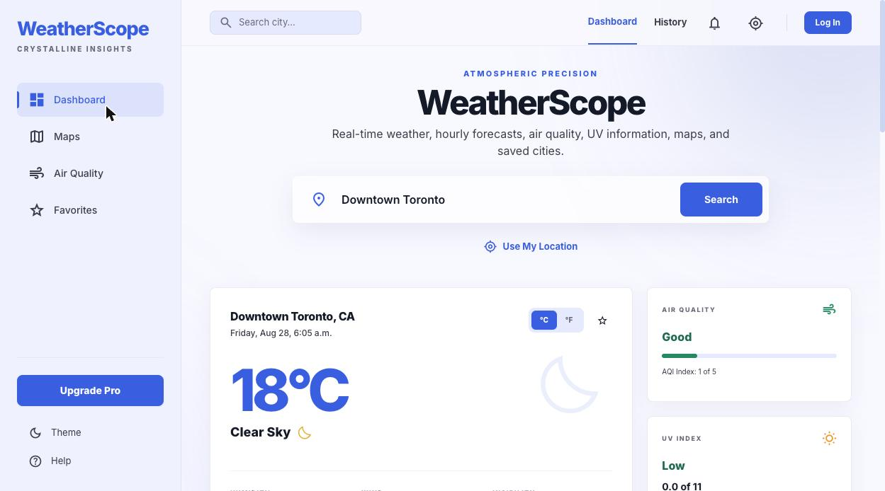
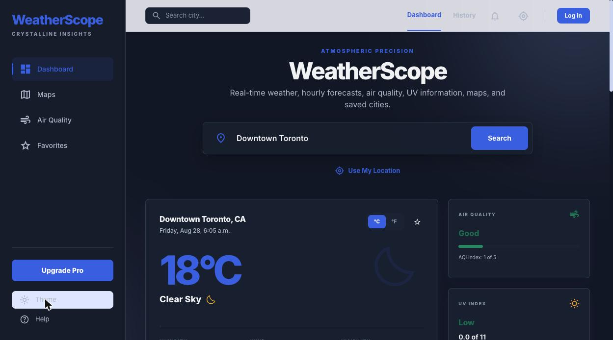
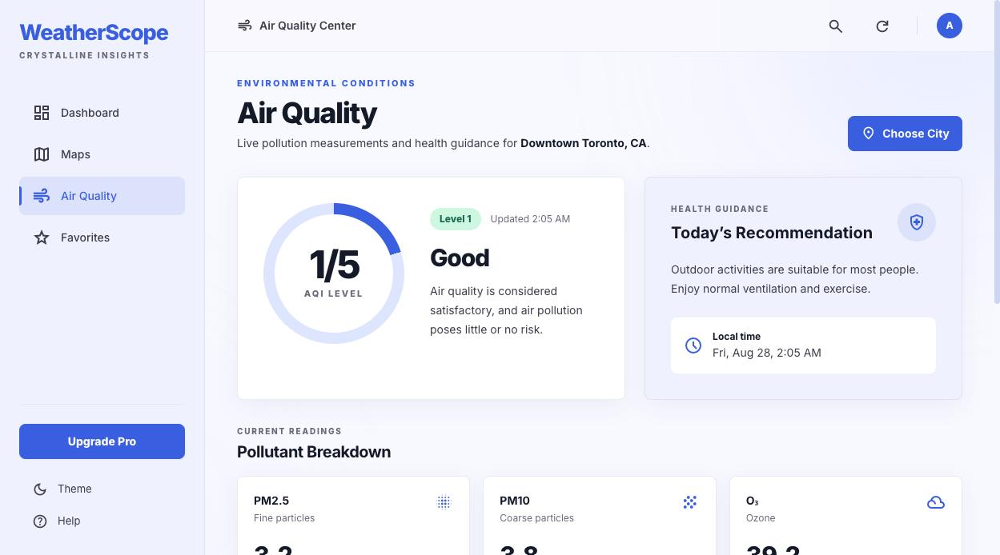
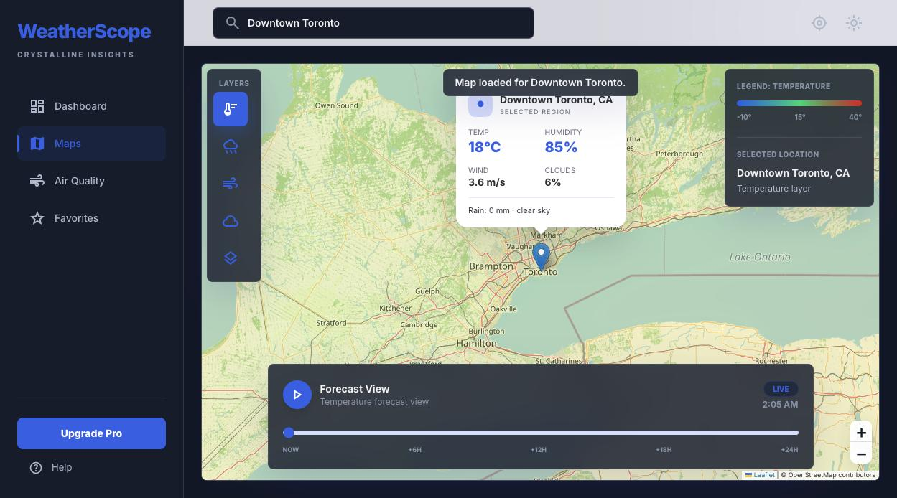

# WeatherScope

> A modern weather dashboard built with JavaScript, Tailwind CSS, and the OpenWeather API.

WeatherScope provides real-time weather forecasts, air quality information, interactive maps, weather alerts, and favorite city management through a modern dashboard interface.

---

## Preview



---

## Features

### Current Weather

- Real-time weather data
- Feels-like temperature
- Humidity
- Wind speed
- Visibility
- Pressure

### Hourly Forecast

- Hourly weather forecast
- Dynamic weather icons
- Responsive card layout

### Five-Day Forecast

- Daily forecast
- High and low temperatures
- Weather conditions

### Maps

- Interactive weather map
- City location display
- Weather-based map integration

### Air Quality

- AQI index
- Air quality level
- Health-related guidance

### Favorites

- Save favorite cities
- Quick access to saved locations
- LocalStorage persistence

### Weather Alerts

- Rain notifications
- Snow alerts
- Severe weather warnings

### Interface

- Modern dashboard layout
- Dark and light mode
- Responsive design
- Material Design-inspired components
- Glass-style interface elements

---

## Tech Stack

### Frontend

- HTML5
- CSS3
- Tailwind CSS
- JavaScript ES6 modules

### APIs

- OpenWeather API
- OpenWeather Geocoding API
- OpenWeather Air Pollution API

### Libraries

- Leaflet.js
- Font Awesome
- Material Symbols

---

## Screenshots

### Dashboard


### Dark Mode



### Air Quality



### Maps



### Favorites


---

## Project Structure

```text
WeatherScope
├── css
├── js
│   ├── api.js
│   ├── ui.js
│   ├── models.js
│   ├── favorites.js
│   └── ...
├── index.html
├── favorites.html
└── README.md
```

---

## Installation

Clone the repository:

```bash
git clone https://github.com/dayunbibi/WeatherScope.git
```

Move into the project folder:

```bash
cd WeatherScope
```

Run the project using Live Server or another local development server.

---

## Roadmap

- [x] Current weather
- [x] Hourly forecast
- [x] Five-day forecast
- [x] Favorite cities
- [x] Dark mode
- [x] Air quality
- [x] Interactive map
- [ ] User authentication
- [ ] Push notifications
- [ ] PWA improvements
- [ ] AI weather summary

---

## Future Improvements

- Supabase authentication
- User profiles
- Cloud synchronization
- Notification center
- Weather history
- Weather analytics
- AI-powered recommendations

---

## Author

Dayun Yu

Computer Programming Student  
Toronto, Canada
